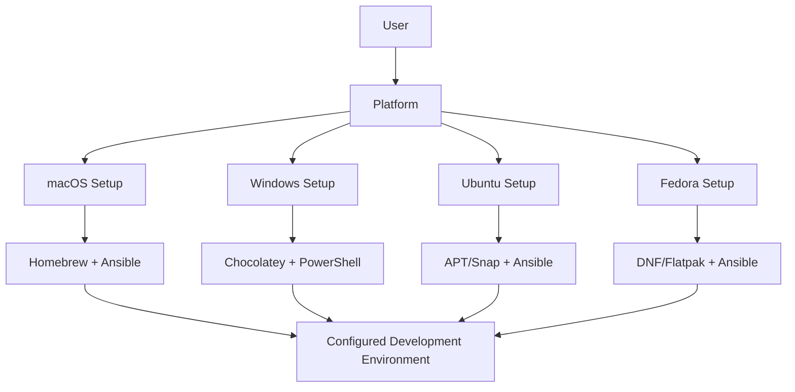
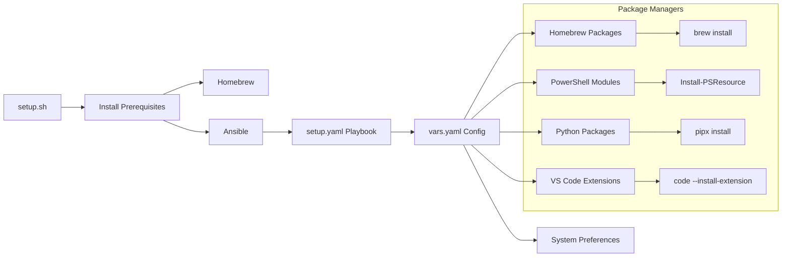
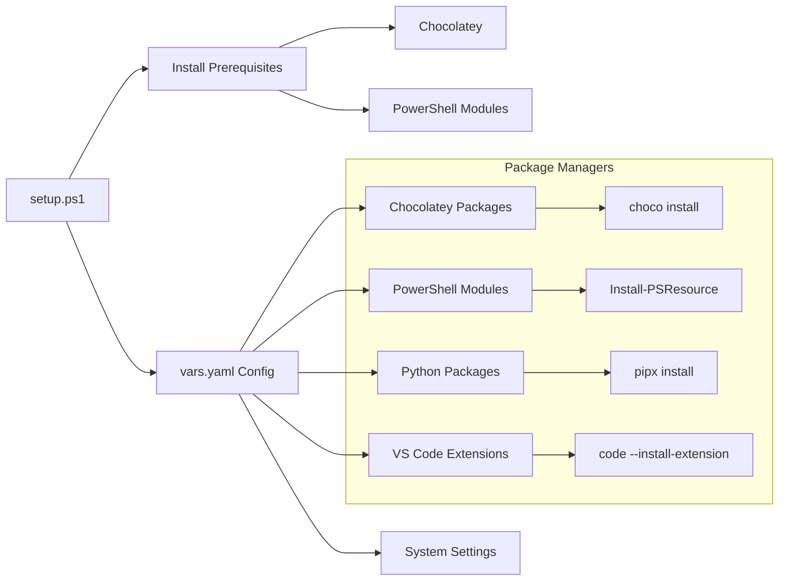
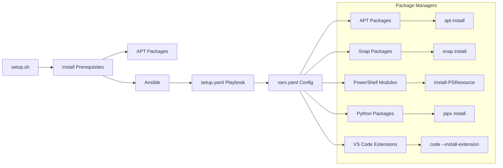
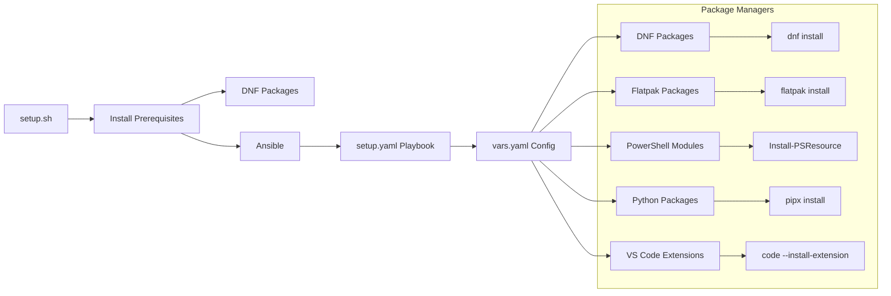
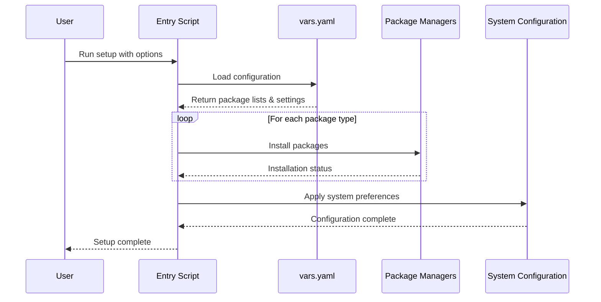
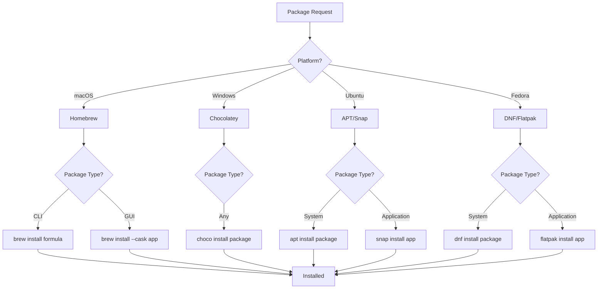
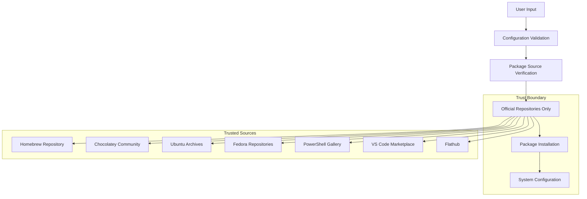
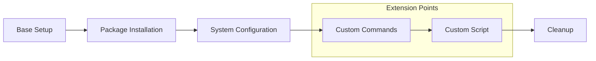
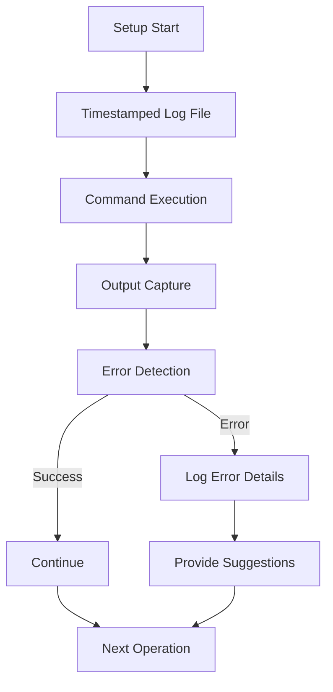

# Architecture Overview

This document provides a high-level view of how the dev-machine-setup project is structured
and how its components work together to provide automated development environment setup
across multiple platforms.

## Repository Structure

```text
dev-machine-setup/
├── README.md                    # Project overview and quick start
├── LICENSE                      # MIT license
├── examples/                    # Cross-platform example configurations
│   ├── macOS_vars.yaml         # Example macOS configuration
│   ├── windows_vars.yaml       # Example Windows configuration
│   ├── ubuntu_vars.yaml        # Example Ubuntu configuration
│   ├── fedora_vars.yaml        # Example Fedora configuration
│   └── *_custom_script.*       # Example custom scripts
├── docs/                       # Comprehensive documentation
│   ├── README.md               # Documentation index
│   ├── design-principles.md    # Core design principles
│   ├── architecture.md         # This document
│   └── ...                     # Additional documentation
├── macOS/                      # macOS-specific implementation
│   ├── setup.sh               # Entry point script
│   ├── setup.yaml             # Ansible playbook
│   ├── vars.yaml              # Configuration variables
│   └── examples/              # macOS-specific examples
├── windows/                    # Windows-specific implementation
│   ├── setup.ps1              # PowerShell setup script
│   ├── vars.yaml              # Configuration variables
│   └── examples/              # Windows-specific examples
├── ubuntu/                     # Ubuntu-specific implementation
│   ├── setup.sh               # Entry point script
│   ├── setup.yaml             # Ansible playbook
│   ├── vars.yaml              # Configuration variables
│   └── examples/              # Ubuntu-specific examples
└── fedora/                     # Fedora-specific implementation
    ├── setup.sh               # Entry point script
    ├── setup.yaml             # Ansible playbook
    ├── vars.yaml              # Configuration variables
    └── examples/              # Fedora-specific examples
```

## Component Architecture

### Platform Independence Layer



Each platform provides:

- **Entry Point**: Consistent script parameter interface across platforms
- **Package Management**: Platform-native package managers
- **Configuration**: Platform-specific variable files
- **Automation**: Platform-appropriate automation tools

### macOS Architecture



**Key Components:**

- `setup.sh`: Bash script that handles prerequisites and launches Ansible
- `setup.yaml`: Ansible playbook with tagged tasks for different components
- `vars.yaml`: YAML configuration file with package lists and settings
- **Homebrew**: Primary package manager for CLI tools and applications
- **Ansible**: Automation engine providing idempotent configuration

### Windows Architecture



**Key Components:**

- `setup.ps1`: PowerShell script that handles the entire setup process
- `vars.yaml`: YAML configuration file (parsed by PowerShell-Yaml module)
- **Chocolatey**: Primary package manager for applications and tools
- **PowerShell**: Native automation and package management capabilities

### Ubuntu Architecture



**Key Components:**

- `setup.sh`: Bash script that handles prerequisites and launches Ansible
- `setup.yaml`: Ansible playbook with tagged tasks for different components
- `vars.yaml`: YAML configuration file with package lists and settings
- **APT**: System package manager for CLI tools and libraries
- **Snap**: Application package manager for GUI applications
- **Ansible**: Automation engine providing idempotent configuration

### Fedora Architecture



**Key Components:**

- `setup.sh`: Bash script that handles prerequisites and launches Ansible
- `setup.yaml`: Ansible playbook with tagged tasks for different components
- `vars.yaml`: YAML configuration file with package lists and settings
- **DNF**: System package manager for CLI tools and libraries
- **Flatpak**: Application package manager for GUI applications
- **Ansible**: Automation engine providing idempotent configuration

## Data Flow

### Configuration Processing



### Package Installation Flow

1. **Load Configuration**: Read `vars.yaml` and merge with command-line parameters
2. **Install Prerequisites**: Ensure package managers and automation tools are available
3. **Process Package Lists**: Install packages by category (CLI tools, applications, extensions, etc.)
4. **Configure System**: Apply system preferences and configurations
5. **Run Custom Commands**: Execute user-defined commands and scripts
6. **Cleanup**: Remove temporary files and credentials

## Package Management Strategy

### Package Categories

Each platform organizes packages into logical categories:

| Category | macOS | Windows | Ubuntu | Fedora |
| -------- | ----- | ------- | ------ | ------ |
| CLI Tools | `homebrew_formulae` | `choco_packages` | `apt_packages` | `dnf_packages` |
| Applications | `homebrew_casks` | `choco_packages` | `snap_packages` | `flatpak_packages` |
| VS Code Extensions | `vscode_extensions` | `vscode_extensions` | `vscode_extensions` | `vscode_extensions` |
| PowerShell Modules | `powershell_modules` | `powershell_modules` | `powershell_modules` | `powershell_modules` |
| Python Packages | `pipx_packages` | `pipx_packages` | `pipx_packages` | `pipx_packages` |
| Node.js Packages | `npm_global_packages` | `npm_global_packages` | `npm_global_packages` | `npm_global_packages` |
| .NET Tools | `dotnet_tools` | `dotnet_tools` | `dotnet_tools` | `dotnet_tools` |

### Package Manager Integration



## Security Model

### Privilege Escalation

- **Minimal Elevation**: Only request administrator privileges when necessary
- **Scoped Permissions**: Elevated permissions are used only for specific tasks
- **Credential Cleanup**: Temporary credentials are securely removed after use

### Trust Boundaries



## Extensibility Points

### Configuration Extension

Users can extend the setup through:

1. **Package Lists**: Add/remove packages by editing arrays in `vars.yaml`
2. **Custom Commands**: Define additional commands in `custom_commands_user` and `custom_commands_elevated`
3. **Custom Scripts**: Point to external scripts via the `custom_script` variable
4. **System Preferences**: Modify platform-specific preference commands

### Script Extension



## Error Handling and Recovery

### Retry Logic

- **Network failures**: Automatic retry for download failures
- **Permission issues**: Clear error messages with suggested solutions
- **Package conflicts**: Skip conflicting packages with warnings

### State Management

- **Idempotent operations**: Safe to run multiple times
- **State checking**: Verify current state before making changes
- **Rollback capability**: Some operations support automatic rollback

### Logging Strategy



All operations are logged with:

- **Timestamps**: When each operation occurred
- **Command details**: Exact commands executed
- **Output capture**: Full stdout/stderr from operations
- **Error context**: Additional information for troubleshooting

## Performance Considerations

### Parallel Operations

Where possible, the setup performs operations in parallel:

- **Package downloads**: Multiple packages downloaded simultaneously
- **Independent installations**: Non-conflicting packages installed in parallel
- **Platform optimization**: Each platform uses its native parallel capabilities

### Caching Strategy

- **Package managers**: Leverage built-in caching (Homebrew, Chocolatey, APT, DNF)
- **Download caching**: Avoid re-downloading already cached packages
- **State caching**: Remember completed operations to avoid repetition

This architecture provides a robust, maintainable, and extensible foundation
for automated development environment setup across multiple platforms
while maintaining consistency and reliability.
